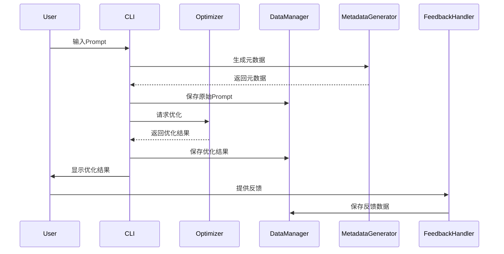

# Prompt Optimizer Platform🚀

[](https://opensource.org/licenses/MIT)

智能Prompt优化管理平台，实现从创建到持续改进的全生命周期管理。🌟

## ✨ 功能特性

- **Prompt优化**：输入原始Prompt，获取优化后的版本📝→📝
- **交互结果记录**：保存与AI的交互结果📋
- **反馈系统**：支持评分、文字评价和是否通过三种反馈方式⭐📝✅
- **记录管理**：查看历史优化记录，支持搜索和展开查看详情🔍📜
- **数据持久化**：使用SQLite数据库保存所有记录💾

## 🛠️ 技术栈
| 领域   | 技术选型                                   |
| ---- | -------------------------------------- |
| 前端   | React + TypeScript + Ant Design + Vite🌐💻 |
| 后端   | FastAPI + SQLite🖥️💾                       |
| AI集成 | LangChain + OpenAI🤖🧠                     |

## 🚀 快速开始

### 安装步骤

```powershell
# 1. 克隆仓库
git clone https://github.com/nwafufhy/prompt-optimizer.git
cd prompt-optimizer

# 前端依赖
cd frontend; npm install

# 后端依赖
conda create -n env-prompt-optimizer python=3.10
cd ../backend
pip install -r requirements.txt -i https://pypi.tuna.tsinghua.edu.cn/simple
```
准备配置文件：config.json
```json
{
    "api_keys": {
        "DMXAPI_API_KEY_1": "YOUR_API_KEY"
    },
    "base_urls": {
        "DMXAPI_REST_URL_1": "https://www.dmxapi.com/v1/"
    },
    "model_names":{
        "DMXAPI_MODEL":"deepseek-v3"
    }
}
```
>当前还没有自定义接口，暂时用的dmxapi的接口服务，本质上是类OPENAI接口
### 运行项目

```powershell
# 前端
cd frontend; npm run dev

# 后端
cd backend; python api.py
```
打开浏览器访问 `http://localhost:5173`🌐🔍
## 项目结构

```
prompt-optimizer/
├── backend/               # 后端代码
│   ├── api.py             # FastAPI主文件
│	├── config.json        # 大模型api配置文件
│   ├── data_manager.py    # 数据管理模块
│   ├── optimizer.py       # Prompt优化逻辑
│   └── requirements.txt   # Python依赖
├── frontend/              # 前端代码
│   ├── public/
│   ├── src/
│   │   ├── App.tsx        # 主组件
│   │   ├── App.css        # 样式文件
│   │   └── main.tsx       # 入口文件
│   ├── package.json
│   └── vite.config.ts
└── README.md              # 项目说明文件
```
## 使用说明

1. 在左侧输入原始 Prompt，点击 "优化" 按钮 🖱️📝
2. 查看优化后的 Prompt 📝
3. 输入与 AI 的交互结果并保存 📋
4. 选择反馈类型并提交反馈 ⭐📝✅
5. 在左侧查看历史记录，支持搜索和展开查看详情 🔍📜

## 架构图


